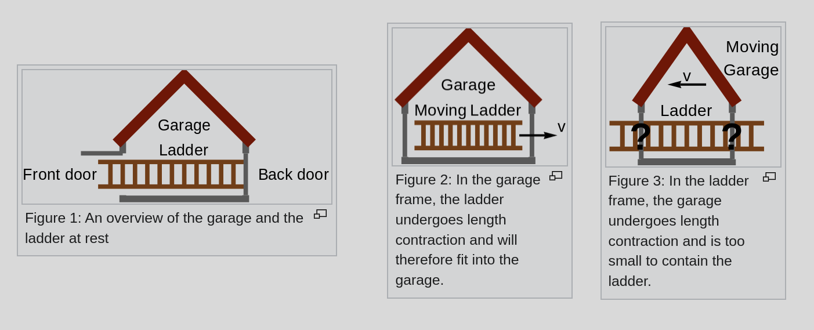

<!--_color: #FF6-->
# <!--fit--> Special and General Relativity

by Damian Chorążkiewicz 

---
<!--_color: #FF6-->
## <!--fit--> ..:: Special Relativity ::..

---

<iframe width="560" height="315" src="https://www.youtube.com/embed/-jJ5PPcLUw8?si=9XZiP4IIPdAlu_Hl" title="YouTube video player" frameborder="0" allow="accelerometer; autoplay; clipboard-write; encrypted-media; gyroscope; picture-in-picture; web-share" referrerpolicy="strict-origin-when-cross-origin" allowfullscreen></iframe>

---

## Annus mirabilis papers

- Paper explained the photoelectric effect!

- Paper introduced the theory of special relativity!

- Paper introduced the theory of Brownian motion!

- Paper introduced the theory of mass-energy equivalence $E=mc^2$!

---
## Special Relativity

- The laws of physics are the same in all inertial frames of reference.

- The speed of light in vacuum is the same for all observers, regardless of the motion of the light source or observer.

---
## Galilean transformation [ ...](https://en.wikipedia.org/wiki/Galilean_transformation)

$$
\begin{aligned}
x' &= x - vt \\
y' &= y \\
z' &= z \\
t' &= t
\end{aligned}   
$$

---
## Time dilation [ ...](https://en.wikipedia.org/wiki/Time_dilation)

$$
\Delta t' = \frac{\Delta t}{\sqrt{1 - \frac{v^2}{c^2}}}
$$

for 

$v=.99c$

$\Delta t' = 7.09 \Delta t$

---
## Origin of Lorentz transformation

---
## Lorenz transformation [ ...](https://en.wikipedia.org/wiki/Lorentz_transformation)

$$
\begin{aligned}
x' &= \gamma(x - vt) \\
y' &= y \\
z' &= z \\
t' &= \gamma(t - \frac{v}{c^2}x)
\end{aligned}
$$

where

$\gamma = \frac{1}{\sqrt{1 - \frac{v^2}{c^2}}}$

---
## Space time diagram

---

---

---
## Length contraction [ ...](https://en.wikipedia.org/wiki/Length_contraction)

$$
\begin{aligned}
x_1' &= \gamma(x_1 - vt_1) \\
x_2' &= \gamma(x_2 - vt_2) \\
\end{aligned}
$$

if $t_1 = t_2$ we have

$$
x_2'- x_1' = \gamma(x_2 - x_1)
$$

---
## Geometric interpretation

---
## The twin paradox

---
## The ladder paradox [ ...](https://en.wikipedia.org/wiki/Ladder_paradox)

---
## Addition of velocities [ ...](https://en.wikipedia.org/wiki/Velocity-addition_formula)

$$
\begin{aligned}
dx &= \gamma(dx' + vdt') \\
dt &= \gamma(dt' + \frac{v}{c^2}dx')
\end{aligned}
$$

$$
u = \frac{dx}{dt} = \frac{dx' + vdt'}{dt' + \frac{v}{c^2}dx'} = \frac{v' + v}{1 + \frac{v'v}{c^2}}
$$

if $v' = c$ we have

$$
u = \frac{v' + v}{1 + \frac{v'v}{c^2}} = \frac{c + v}{1 + \frac{cv}{c^2}} = \frac{c + v}{1 + \frac{v}{c}} = c
$$

---
## Energy-momentum relation [ ...](https://en.wikipedia.org/wiki/Energy%E2%80%93momentum_relation)

$$
{\large {\color{lightgreen}E^2} = {\color{red}(pc)^2} + {\color{yellow}(m_0c^2)^2}}
$$

where

- $E$ is the total energy of the particle

- $p$ is the momentum of the particle

- $m_0$ is the rest mass of the particle

  ### Special cases

- $m=0$ (photon) $E=pc$

- $p=0$ (rest mass) $E=m_0c^2$

- $v<<c$ (classical mechanics) $E=\frac{1}{2}mv^2+mc^2$

---
<!--_color: #FF6-->

## <!--fit--> ..:: General Relativity ::..

---

## Falling of elevator

<iframe width="560" height="315" src="https://www.youtube.com/embed/jx3wcdCtL58?si=oLNcKtAImsfHq3Jx" title="YouTube video player" frameborder="0" allow="accelerometer; autoplay; clipboard-write; encrypted-media; gyroscope; picture-in-picture; web-share" referrerpolicy="strict-origin-when-cross-origin" allowfullscreen></iframe>

---

## Equivalence principle

---

---

## Einstein field equations [ ...](https://en.wikipedia.org/wiki/Einstein_field_equations)

$$
\Large R_{\mu\nu} - \frac{1}{2}g_{\mu\nu}R + g_{\mu\nu}\Lambda = \frac{8\pi G}{c^4}T_{\mu\nu}
$$

---

## Mathematical formulation

$$
{\color{red}g_{\mu\nu}} = \begin{pmatrix} g_{00}(t,x,y,z) & g_{01}(t,x,y,z) & g_{02}(t,x,y,z) & g_{03}(t,x,y,z) \\ g_{10}(t,x,y,z) & g_{11}(t,x,y,z) & g_{12}(t,x,y,z) & g_{13}(t,x,y,z) \\ g_{20}(t,x,y,z) & g_{21}(t,x,y,z) & g_{22}(t,x,y,z) & g_{23}(t,x,y,z) \\ g_{30}(t,x,y,z) & g_{31}(t,x,y,z) & g_{32}(t,x,y,z) & g_{33}(t,x,y,z) \end{pmatrix}
$$

$$
{\color{yellow}\Gamma^{\mu}_{\nu\lambda}} = \frac{1}{2}{\color{red}g^{\mu\sigma}}\left(\frac{\partial{\color{red}g_{\sigma\nu}}}{\partial x^{\lambda}} + \frac{\partial{\color{red}g_{\sigma\lambda}}}{\partial x^{\nu}} - \frac{\partial{\color{red}g_{\nu\lambda}}}{\partial x^{\sigma}}\right)
$$

$$
{\color{pink}R^{\mu}_{\nu\lambda\sigma}} = \frac{\partial{\color{yellow}\Gamma^{\mu}_{\nu\sigma}}}{\partial x^{\lambda}} - \frac{\partial{\color{yellow}\Gamma^{\mu}_{\nu\lambda}}}{\partial x^{\sigma}} + {\color{yellow}\Gamma^{\mu}_{\lambda\tau}}{\color{yellow}\Gamma^{\tau}_{\nu\sigma}} - {\color{yellow}\Gamma^{\mu}_{\sigma\tau}}{\color{yellow}\Gamma^{\tau}_{\nu\lambda}}
$$

---
## Schwarzschild metric [ ...](https://en.wikipedia.org/wiki/Schwarzschild_metric)

$$
g_{\mu\nu} = \begin{pmatrix} -\left(1-\frac{2GM}{c^2r}\right) & 0 & 0 & 0 \\ 0 & \left(1-\frac{2GM}{c^2r}\right)^{-1} & 0 & 0 \\ 0 & 0 & r^2 & 0 \\ 0 & 0 & 0 & r^2\sin^2\theta \end{pmatrix}
$$

 

$$
ds^2 = -\left(1-\frac{2GM}{c^2r}\right)c^2dt^2 + \left(1-\frac{2GM}{c^2r}\right)^{-1}dr^2 + r^2d\theta^2 + r^2\sin^2\theta d\phi^2
$$

---
## Curved  space-time

---
## Time dilation in Schwarzschild metric

$$
\frac{\nu_o}{\nu_e} = \sqrt{\frac{1-\frac{2GM}{c^2r_e}}{1-\frac{2GM}{c^2r_o}}}
$$

case $r_e = 4M$ and $r_o = \infty$

$$
\frac{\nu_o}{\nu_e} = \sqrt{\frac{1-\frac{2GM}{c^2\cdot 4M}}{1-\frac{2GM}{c^2\cdot \infty}}} = \frac{1}{\sqrt{2}}=0.707
$$

---

Time dilation explains why two working clocks will report different times after different accelerations. For example, time goes slower at the ISS, lagging approximately 0.01 seconds for every 12 Earth months passed. For GPS satellites to work, they must adjust for similar bending of spacetime to coordinate properly with systems on Earth.

---
## Gravitational redshift in Schwarzschild metric

$$
\frac{\lambda_e}{\lambda_o} = \sqrt{\frac{1-\frac{2GM}{c^2r_e}}{1-\frac{2GM}{c^2r_o}}}
$$

for $\lambda_e=450nm$ (blue) we have $\lambda_o=637nm$ (red)

---

---
## Light deflection [ ...](https://en.wikipedia.org/wiki/Introduction_to_the_mathematics_of_general_relativity)  

---
## Gravitational lensing [ ...](https://en.wikipedia.org/wiki/Gravitational_lens)

---
## Black holes [ ...](https://en.wikipedia.org/wiki/Black_hole)

---

---

---
## Hawking radiation [ ...](https://en.wikipedia.org/wiki/Hawking_radiation)

### Temperature of black hole

$$
T = \frac{\hbar c^3}{8\pi GMk} 
$$

### time to evaporate

$$
t = \frac{5120\pi G^2M^3}{\hbar c^4} \sim 2.67\cdot 10^{67} \left(\frac{M}{M_{\odot}}\right)^3 s
$$

example for $M=M_{\odot}$ we have $t=2.67\cdot 10^{67}s$

---

<iframe width="560" height="315" src="https://www.youtube.com/embed/kOEDG3j1bjs?si=1rvyaG46n3krfyeP" title="YouTube video player" frameborder="0" allow="accelerometer; autoplay; clipboard-write; encrypted-media; gyroscope; picture-in-picture; web-share" referrerpolicy="strict-origin-when-cross-origin" allowfullscreen></iframe>

---
## Gravitational waves [ ...](https://en.wikipedia.org/wiki/Gravitational_wave)

[LIGO](https://www.ligo.caltech.edu/gallery)

---
## Friedmann-LeMaître-Robertson-Walker metric [ ...](https://en.wikipedia.org/wiki/Friedmann%E2%80%93Lema%C3%AEtre%E2%80%93Robertson%E2%80%93Walker_metric)

$$
ds^2 = -c^2dt^2 + a(t)^2\left(\frac{dr^2}{1-kr^2} + r^2d\theta^2 + r^2\sin^2\theta d\phi^2\right)
$$

where

- $a(t)$ is the scale factor

- $k$ is the curvature of the universe

### Huble's law

$$
H(t)^2=\left(\frac{\dot{a}(t)}{a(t)}\right)^2 = \frac{8\pi G}{3}\rho(t) - \frac{kc^2}{a(t)^2}+\frac{\Lambda c^2}{3}
$$

---

## Expansion of the universe [ ...](https://en.wikipedia.org/wiki/Expansion_of_the_universe)

---
## Shape of the universe [ ...](https://en.wikipedia.org/wiki/Shape_of_the_universe)

