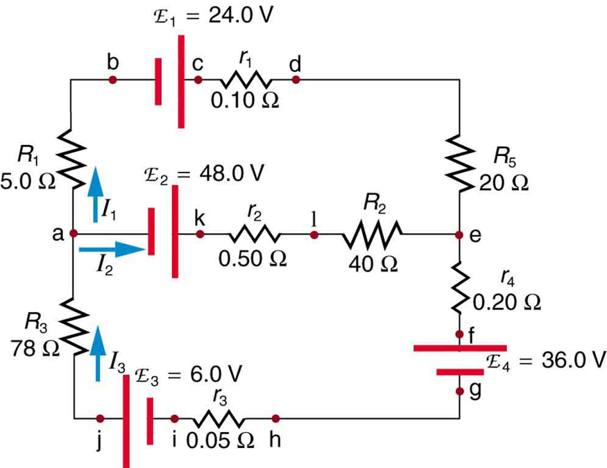

1. Z Ziemi wyrwaliśmy 100kg elektronów i przesłaliśmy na Księżyc. Co się stanie z siłą oddziaływania między Ziemią a Księżycem?

Odpowiedź: Siła grawitacyjna między Ziemią a Księżycem zmniejszy się.

2. Mamy dwa ładunki q1=10^-5[C] w punkcie (x,y)=(0,0)[m] oraz q2=9*10^-5[C] w punkcie (x,y)=(0,2)[m]. Znajdź punkt równowagi nietrwałej.

3. Kondensator płaski o pojemności 10 µF został naładowany w ciągu jednej sekundy ładunkiem Q = 2.5 C. Oblicz strumień pola elektrycznego otaczającego ujemną okładkę kondensatora.

4. Mamy przewód w kształcie okręgu o promieniu 12 cm. Do tego przewodu podłączony jest opornik o oporności 500 omów. Przez środek tego przewodu przelatuje magnes lodówkowy. Które z poniższych zdań są prawdziwe:

a) Magnes będzie spadał dłużej w porównaniu do sytuacji bez przewodnika.
b) Opornik wytworzy ciepło.
c) Opornik wytworzy ciepło oraz magnes będzie spadał wolniej niż bez obecności opornika.
d) Opornik wytworzy ciepło oraz magnes będzie spadał szybciej niż bez obecności przewodnika.

5. Opornorność zastępcza 3 oporników (R1, R2, R3) połączonych równolegle wynosi

a) 1/(1/R1 + 1/R2 + 1/R3)

b) R1 + R2 + R3

c) 1/R1 + 1/R2 + 1/R3

d) R1*R2 + R2*R3 + R1*R3

6. Dwa przewodniki, w których płynie prąd, oddziałują na siebie dzięki:

a) oddziaływaniu elektrostatycznemu

b) sile Lorentza

c) oddziaływaniu grawitacyjnemu

d) regule Lenza

7. Dla poniższego rysunku, które równanie opisuje jedno z oczek?

a) $I_3 = I_1 + I_3$

b) $E_1-I_1 r_1-R_5I_1+R_2I_2+r_2I_2-E_2-R_1I_1=0$

c) $E_1-I_1 r_1-R_5I_1+R_2I_2+r_2I_2+E_2-R_1I_1=0$

d) $E_1-I_1 r_1-R_5I_1-R_2I_2+r_2I_2-E_2-R_1I_1=0$

8. Czy układ LC może działać w nieskończoność zakładając brak oporności w układzie?

a) Tak, bedziemy mieć do czynienia sygnałem sinusoidalnym.

b) Nie, układ rozproszy energię w postaci ciepła.

c) Nie, układ rozproszy energię w postaci fali elektromagnetycznej.

9. Czy ryby zawsze widzą co się dzieje nad powierzchnią wody?

a) Tak, widzą wszystko jeśli mają dobre oczy.

b) Nie, widzą tylko to co jest pod powierzchnią wody.

c) Czasami widzą a czasami nie widzą.

10. Czy jeśli przez transformator przepuszczamy prąd o częstotliwości 50Hz to na wyjściu transformatora również będzie prąd o częstotliwości 50Hz?

a) Tak, prąd na wyjściu transformatora będzie miał taką samą częstotliwość jak prąd na wejściu.

b) Nie, prąd na wyjściu transformatora będzie miał inną częstotliwość niż prąd na wejściu.

