# Circuits

## An idea of reducing complexity

### Case 1

#### Initial

This graph represents a simple path from `B+` to `B-` through several nodes (`R1`, `R2`, `R3`, `R4`, and `R5`). The nodes are connected in a linear fashion, with `B+` as the starting point and `B-` as the endpoint.

B+ and B- are the start and end nodes, represents battery endsite. Each

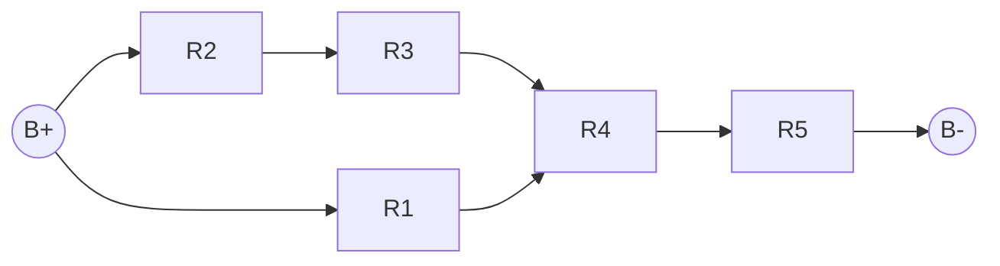

#### First step

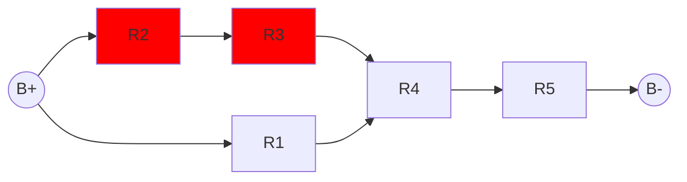
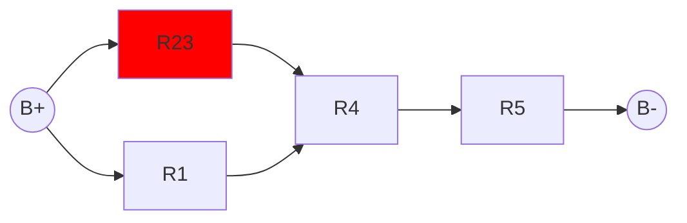

#### Second step

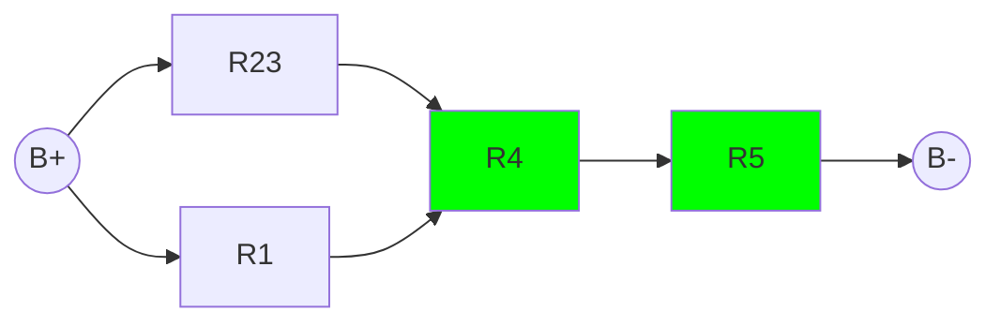
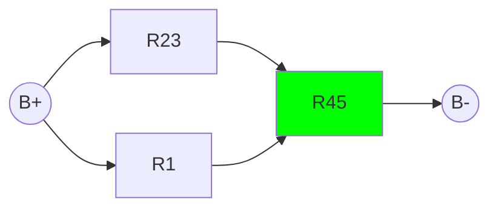

#### Third step

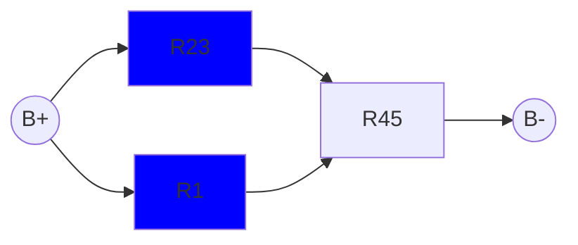

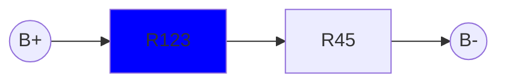

#### Fourth step

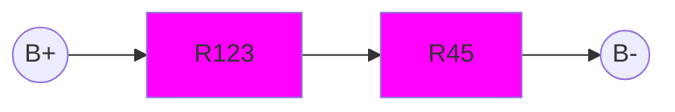

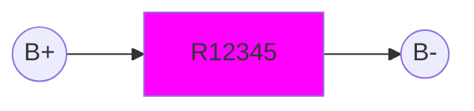

### Case 2

#### Initial

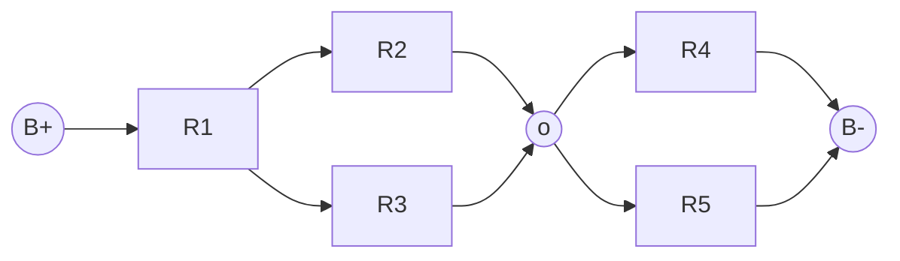

To be more consistent, we should draw

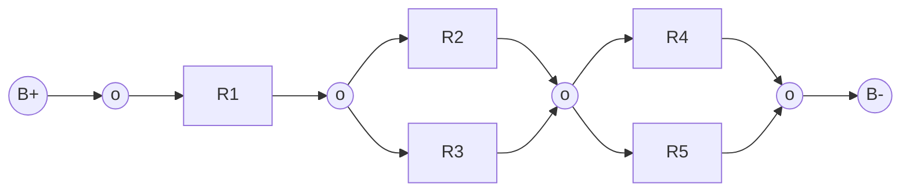

Instead representing the resitors as nodes, we can represent them as edges. This way, we can reduce the complexity of the graph.

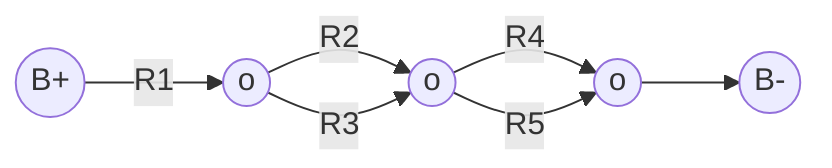

## Building blocks

### Series configuration

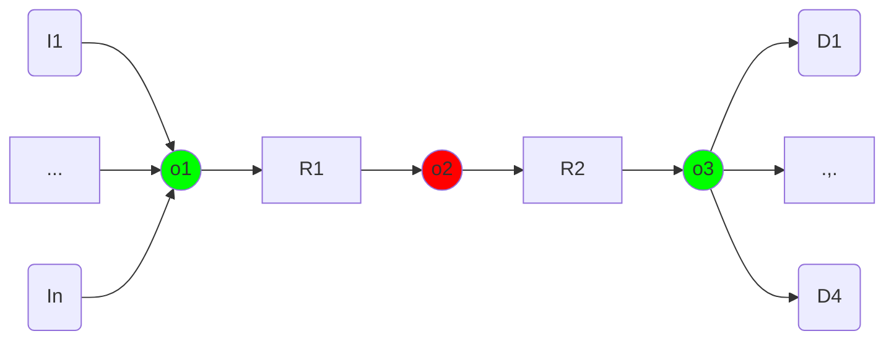

Can be replaced by

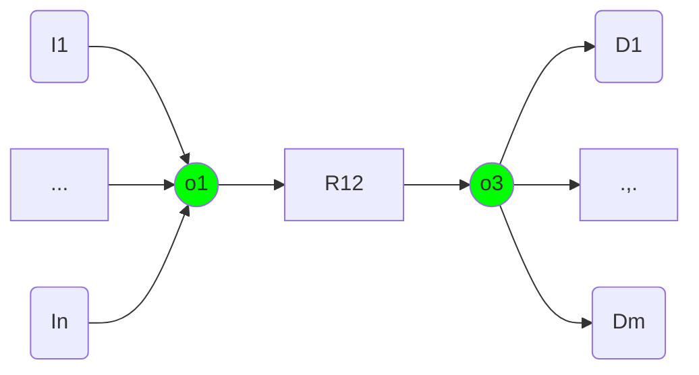

How find this situation?
1. Find the first node with degree 2 (`o2`)
2. Find the nodes to which it is connected: `o1` and `o3`
3. Remove edge `o1-o2` and `o2-o3`
4. Add edge `o1-o3` with the new resistance `R12 = R1 + R2`

### Parallel configuration

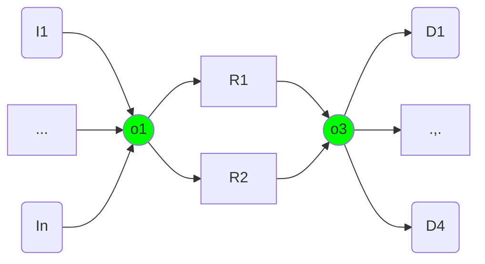

Can be replaced by

How find this situation?
1. Find two edges with the same start and end nodes (`o1` and `o3`)
2. Remove the edges `o1-o3` with label `R1` and `R2`
3. Add edge `o1-o3` with the new resistance `R12 = R1*R2/(R1 + R2)`